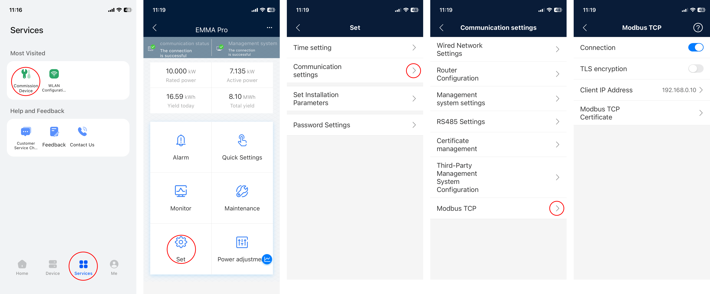

# EMMA Web API


[](https://www.gnu.org/licenses/agpl-3.0)

[](https://github.com/sponsors/StefanOltmann)

This service connects to a Huawei EMMA Modbus device and provides values via a REST API.

This project is not affiliated with or endorsed by Huawei.

## Supported devices

It was tested with a Huawei EMMA-A02 ("Emma Pro") running at `SmartHEMS V100R024C10SPC111`.

## Installation

### Docker

The easiest way to get started is by using Docker Compose.

Here's a typical setup:

```yaml
version: '3.8'

services:
    emma-web-api:
        image: ghcr.io/stefanoltmann/emma-webapi:latest
        container_name: emma-web-api
        restart: always
        environment:
            # Set this to the IP address of your EMMA device
            EMMA_ADDRESS: "192.168.0.100"
            # Optional: Set an API key to protect access
            API_KEY: ""
        ports:
            # Expose the API on your desired host port (host:container)
            - 8100:8080
        healthcheck:
            test: [ "CMD", "curl", "-f", "http://localhost:8080/health" ]
            interval: 15m
            timeout: 30s
            retries: 4
            start_period: 1m
```

### Configure EMMA

Using installer access, configure the **Modbus TCP** settings:

- Set the **Client IP Address** to the IP of the server running this service  
  *(e.g., `192.168.0.10` if that’s your Docker host)*.
- **Disable TLS encryption** — it must be turned off for this service to connect.



## Endpoints

## `/info`

Returns general device info.

Example:

```
{
    "offeringName": "SmartHEMS",
    "serialNumber": "NS1337424242",
    "softwareVersion": "SmartHEMS V100R024C10SPC111"
}
```

## `/status`

Returns the current status.

Example:

```
{
    "pvOutputPower": 5.945,
    "loadPower": 0.125,
    "feedInPower": -5.82,
    "batteryPower": 0.0,
    "batteryStateOfCharge": 100.0
}
```

## `/battery`

Returns the current settings for battery control.

Example:

```
{
    "controlMode": "MAXIMUM_SELF_CONSUMPTION",
    "useOfSurplusPower": "CHARGE",
    "maximumPowerForCharging": 50.0
}
```

## Contributions

Contributions to this project are welcome! If you encounter any issues,
have suggestions for improvements, or would like to contribute new features,
please feel free to submit a pull request.

## Licenses

EMMA Web API is distributed under the GNU Affero General Public License (AGPL),
guaranteeing the community the freedom to use, modify, and share the software.
